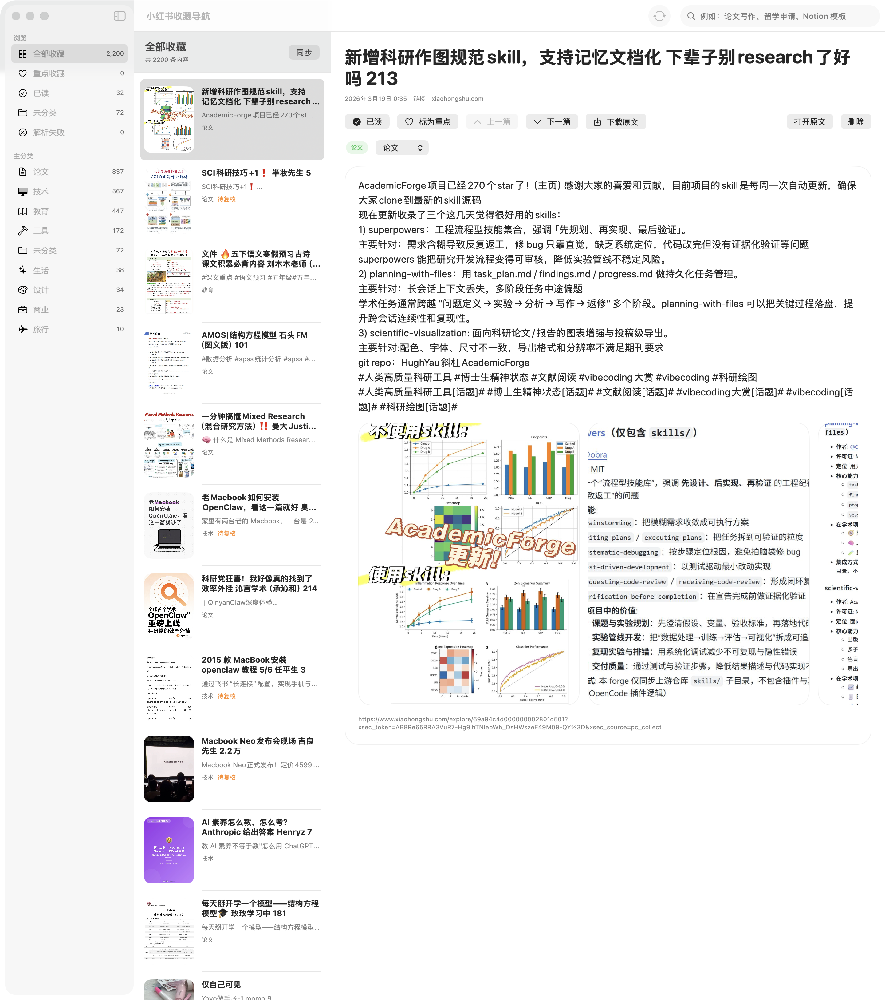
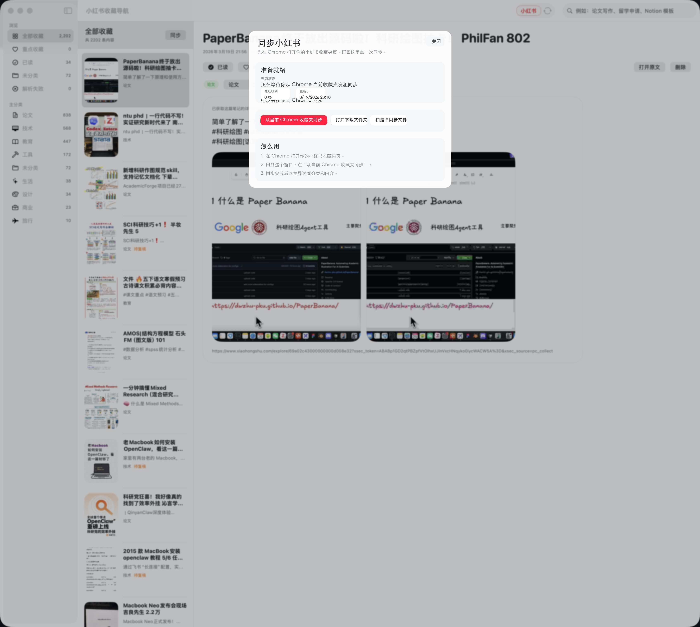
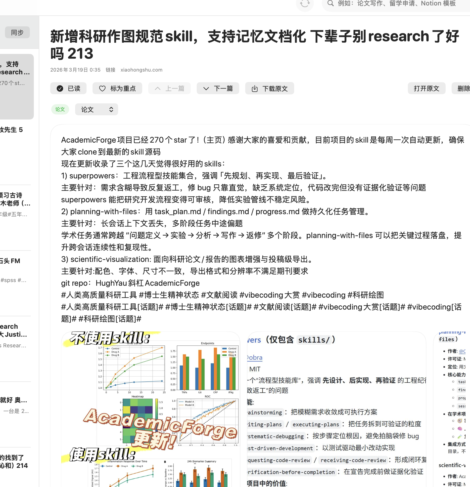

# XHS Organizer

<p align="center">Turn a messy Xiaohongshu favorites folder into a desktop library you can sync, sort, revisit, and export on macOS.</p>

<p align="center"><strong>macOS only. Requires macOS 15 or later. Windows and Linux are not supported.</strong></p>

<p align="center">
  <a href="https://github.com/leoyoyofiona/xiaohongshu-favorites/releases/latest"></a>
  <a href="./LICENSE"></a>
  
  
</p>

<p align="center">
  <a href="./README.md">简体中文</a> · <a href="./README.ja.md">日本語</a>
</p>

<p align="center">
  
</p>

## Why this app

- Saved posts keep growing, but useful content becomes harder to find.
- Papers, tools, tutorials, and inspiration get mixed together.
- Xiaohongshu favorites are good for saving fast, but weak for long-term desktop organization.
- Exporting original text and images manually is tedious.

## What it does

- Syncs from the Xiaohongshu favorites page currently open in Chrome.
- Deduplicates and auto-categorizes posts into major groups.
- Uses a 3-column desktop layout for categories, list, and reading.
- Supports read status, starred items, previous / next navigation, and recent sync review.
- Exports the current article text, source link, and all images in one click.
- Opens Xiaohongshu directly inside the app for browsing and syncing.

## Screenshots

### 1. Full library view


### 2. Sync status



### 3. Read original content or play video



## Install

### Download a release

1. Open [Releases](https://github.com/leoyoyofiona/xiaohongshu-favorites/releases/latest)
2. Download `小红书收藏导航.dmg`
3. Drag `小红书收藏导航.app` into `Applications`
4. If macOS blocks first launch, right-click and choose `Open`

Notes:

- This software is for macOS 15+ only.
- The public install package is distributed as a `.dmg`.

### Run from source

Requirements:

- macOS 15+
- Xcode Command Line Tools
- Swift 6.2

```bash
swift run XHSOrganizerApp
```

## Quick start

1. Open your Xiaohongshu favorites page in Chrome.
2. Open the app.
3. Click `同步小红书`.
4. Click `从当前 Chrome 收藏夹同步`.
5. Browse, classify, revisit, and export inside the app.

## Export current article

Click `下载` in the detail pane to export:

- `原文.txt`
- `原文链接.txt`
- all images from the current post

Saved by default to `Downloads/小红书收藏导出/`

## Current sync model

- Sync currently depends on Chrome because it is the most stable path so far.
- Compared with forcing a fully embedded auto-sync flow, this approach is less likely to trigger platform risk controls.
- Older incomplete items may need one more sync pass to improve original text and image coverage.

## Tech stack

- `SwiftUI + AppKit` for a native macOS UI
- `WKWebView` for in-app Xiaohongshu browsing
- local persistence for saved posts, states, and categories
- custom import, deduplication, reclassification, and export pipeline

## Project structure

- `Sources/XHSOrganizerApp`: macOS UI and desktop logic
- `Sources/XHSOrganizerCore`: models, sync import, classification, search, export
- `scripts/build_dmg.sh`: package `.app` and `.dmg`
- `scripts/generate_app_icon.py`: generate the app icon

## Build a DMG

```bash
./scripts/build_dmg.sh
```

Outputs:

- `dist/小红书收藏导航.app`
- `dist/小红书收藏导航.dmg`

## License

Released under the [MIT License](./LICENSE).
