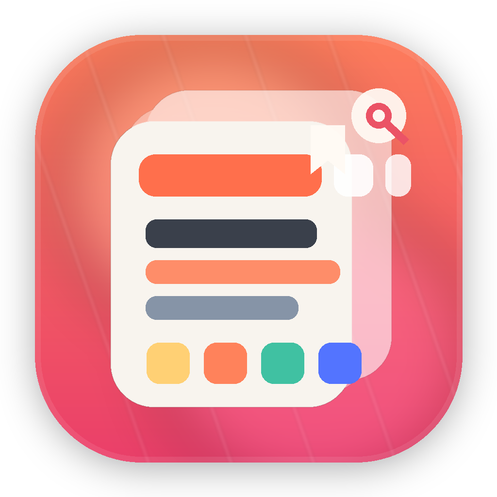

# 小紅書コレクションナビ

[简体中文](./README.md) | [English](./README.en.md)



小紅書のお気に入りを、あとで本当に使える形に整理するための macOS デスクトップアプリです。

[最新版をダウンロード](https://github.com/leoyoyofiona/xiaohongshu-favorites/releases/latest) | [リリースノート](https://github.com/leoyoyofiona/xiaohongshu-favorites/releases/tag/v0.1.0)

## 解決したい課題

- お気に入りが増え続けて、必要な時に見つからない
- 論文、ツール、教育、アイデアが混ざって再利用しにくい
- 小紅書の標準UIは長期整理に向いていない
- 原文や画像をまとめて保存するのが面倒

## 主な機能

- Chrome で開いている小紅書お気に入りページから同期
- 重複排除と自動分類
- 3カラムの見やすいデスクトップUI
- 既読、重要マーク、前の記事 / 次の記事移動
- 現在の記事本文と画像をワンクリックで書き出し

## インストール

### リリースからインストール

1. [Releases](https://github.com/leoyoyofiona/xiaohongshu-favorites/releases/latest) を開く
2. `小红书收藏导航.dmg` をダウンロード
3. `小红书收藏导航.app` を `Applications` にドラッグ
4. 初回起動で止められた場合は、右クリックして `開く`

### ソースから起動

必要環境:

- macOS 15+
- Xcode Command Line Tools
- Swift 6.2

```bash
swift run XHSOrganizerApp
```

## 使い方

1. Chrome で小紅書のお気に入りページを開く
2. アプリを開く
3. `同步小红书` をクリック
4. `从当前 Chrome 收藏夹同步` をクリック
5. 同期後はアプリ内で閲覧、整理、書き出し

## 現在の記事を書き出し

`下载原文` を押すと:

- 本文テキスト
- 元リンク
- 画像一式

を `Downloads/小红书收藏导出/` に書き出します。

## 同期方式

- 現在の同期は Chrome を利用します
- これは現時点で最も安定しやすい方式です
- 埋め込みWeb同期よりもリスク制御に引っかかりにくいです
- 以前の不完全リンクで取り込んだデータは、再同期で改善する場合があります

## パッケージ作成

```bash
./scripts/build_dmg.sh
```

生成物:

- `dist/小红书收藏导航.app`
- `dist/小红书收藏导航.dmg`
